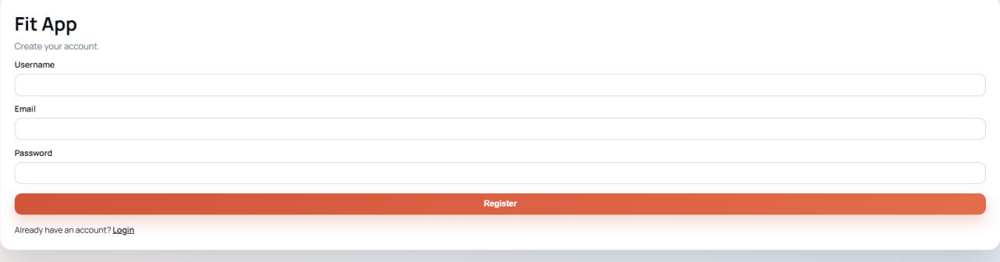
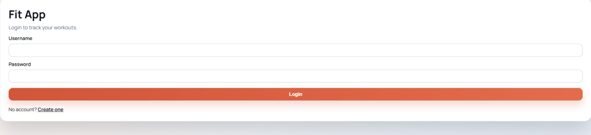
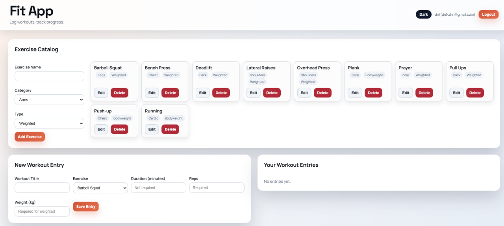
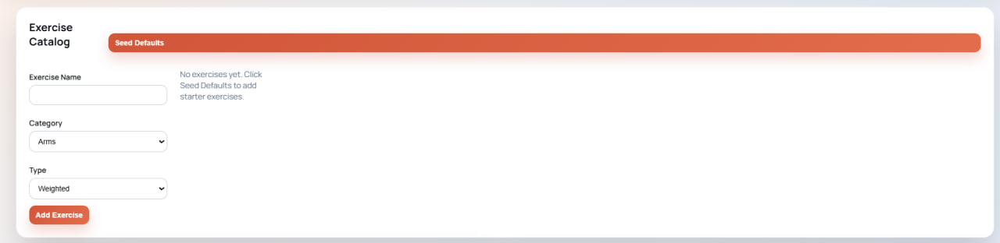
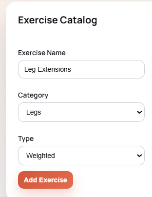
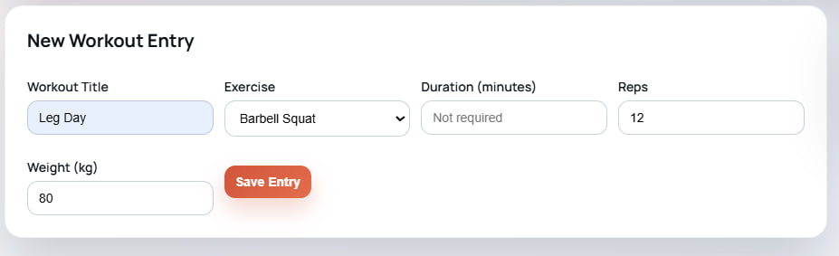
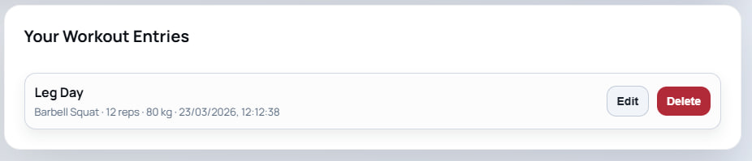

# Cloud WebApp (Fit App)

## Architecture
- Frontend (FE): Nginx serving static HTML/CSS/JS
- Backend (BE): FastAPI REST API
- Database (DB): PostgreSQL with persistent volume

## Technologies
- Frontend: HTML, CSS, JavaScript, Nginx
- Backend: Python 3.12, FastAPI, SQLAlchemy, Uvicorn
- Database: PostgreSQL 16 (Docker Hub)
- Docker: Compose networks and named volume

## Networks and Volume
- Networks:
  - `frontend-network`: FE <-> BE
  - `backend-network`: BE <-> DB
- Volume:
  - `postgres-data`: PostgreSQL data persistence

## Configuration
Environment variables are loaded from `.env`:
- `POSTGRES_USER`
- `POSTGRES_PASSWORD`
- `POSTGRES_DB`
- `SECRET_KEY`

## Run the application
1. Ensure Docker Desktop is running.
2. Start all services:
   ```bash
   docker compose up --build
   ```

## Stop the application
```bash
docker compose down
```

## URLs
- Frontend: http://localhost:3000
- Backend API (Swagger): http://localhost:8000/docs

## Usage
1. Register a user via the frontend or Swagger UI.


2. Login to access the app.


3. Open the main dashboard.


4. Seed default exercises for your account.


5. Add your own exercise.


6. Add a workout entry.


7. Verify the workout entry was added.


## Exercise Catalog Ownership
- Exercise catalogs are user-scoped.
- Exercises created by one user are visible only to that same user.
- Another user must add or seed their own exercises.
- Workout entries can reference only exercises owned by the authenticated user.

